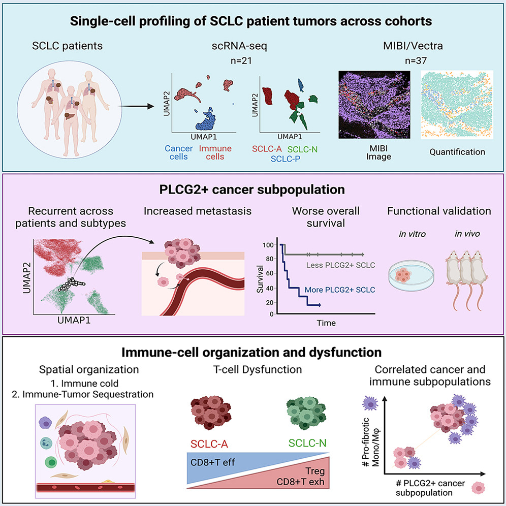

# SCLC_atlas-HTAN
Single-cell atlas of SCLC leveraging scRNA-seq, MIBI, and Vectra imaging, as part of the Human Tumor Atlas Network

Code for reproducing figures for Chan, et al. "Signatures of plasticity, metastasis, and immunosuppression in an atlas of human small cell lung cancer." Cancer Cell, 2021. https://www.cell.com/cancer-cell/fulltext/S1535-6108(21)00497-9

Raw data (fastq, bam, raw dense counts per sample) and processed data (scanpy adata's, etc for the combined vs subsetted dataset) are available for download at the HTAN data portal at https://data.humantumoratlas.org/. In addition, we have provided adata's and Seurat .rds files with corresponding raw counts for download at https://cellxgene.cziscience.com/collections/62e8f058-9c37-48bc-9200-e767f318a8ec. At this website, the data can also be explored interactively through the cellxgene platform.  

Important note: Level 3 data holding UMI dense counts matrices per sample at the HTAN data portal contain an additional feature column "CLUSTER" that represents Phenograph clustering output automatically generated by SEQC. It should not be considered a feature column of counts.

